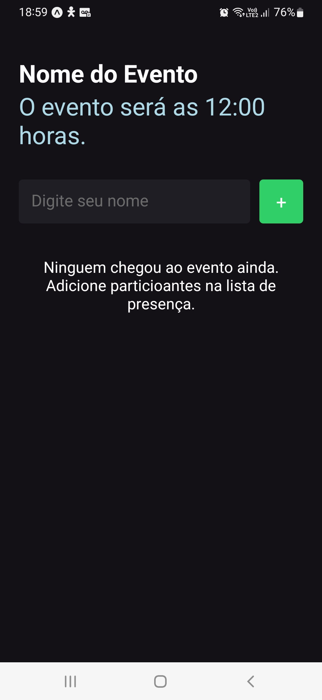
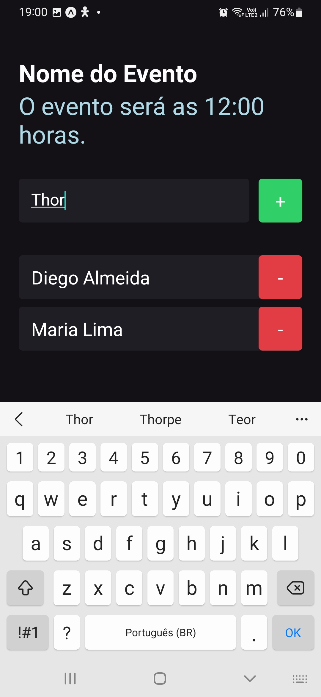
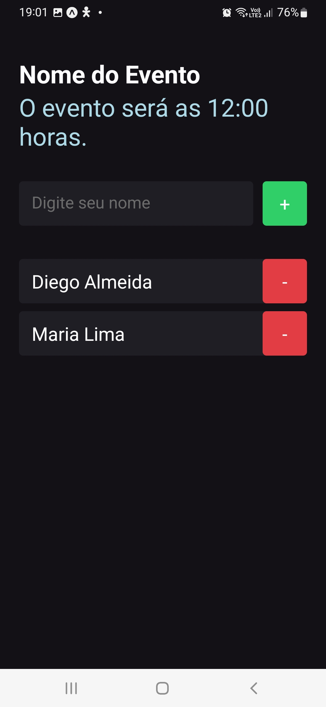

<h2>
  # imhere 
  <br>
  <br>
  Projeto com React Native
</h2>

Foi desenvolvida uma aplicação no Visual Studio Code do curso de Formação React Native da [ROCKETSEAT](https://www.rocketseat.com.br/). O objetivo dessa aplicação é fazer o cadastro de pessoas em um evento. Cada pessoa cadastrada é exibida em uma Flat List. Também é possível excluir as pessoas do evento.
<br>
<br>
<p align="center">
  <a href="#funcionalidades">Funcionalidades</a>&nbsp;&nbsp;&nbsp;|&nbsp;&nbsp;&nbsp;
  <a href="#heavy_check_mark-configurações-necessárias">Configurações necessárias</a>&nbsp;&nbsp;&nbsp;|&nbsp;&nbsp;&nbsp;
  <a href="#arrow_down_small-clonando-o-repositório">Clonando o repositório</a>&nbsp;&nbsp;&nbsp;|&nbsp;&nbsp;&nbsp;
  <a href="#beginner-iniciando-a-aplicação">Iniciando a aplicação</a>&nbsp;&nbsp;&nbsp;|&nbsp;&nbsp;&nbsp;
  <a href="#wrench-tecnologias--ferramentas--recursos">Tecnologias | Ferramentas | Recursos</a>&nbsp;&nbsp;&nbsp;|&nbsp;&nbsp;&nbsp;
  <a href="#memo-license">Licença</a>
</p>

Durante as aulas do foram aprendidos conteúdos relacionados a Classes abstradas, metodos abstrados, interfaces e CRUD, que foram utilizados nesse projeto para criar um pequeno app para cadastro de Séries.

### Funcionalidades

- Cadastrar pessoas;
- Listar pessoas cadastradas em lista;
- Excluir pessoas;


 <p align="center">
    
    
    
    
  </p>

### :heavy_check_mark: Configurações necessárias

Seguem as configurações neessárias para visualizar a aplicação em sua máquina.

-  [Vs Code](https://code.visualstudio.com/download);
-  [NET core - Versão 5.0.302](https://dotnet.microsoft.com/download);
-  Ambiente console application para sistema operacional Windows.

### :arrow_down_small: Clonando o repositório
1. Pelo terminal, acesse o diretório em que deseja ter o repositório clonado e execute o comando a seguir.
```bash
# clonando o repositório
git clone https://github.com/Diegototi/imhere
```

### :beginner: Iniciando a aplicação
1. Rodar aplicação

### :wrench: Tecnologias | Ferramentas | Recursos

Esse projeto foi desenvolvido utilizando os seguintes recursos:

-  [Vs Code](https://code.visualstudio.com/download);
-  [NET core - Versão 5.0.302](https://dotnet.microsoft.com/download);

### :memo: License
Esse projeto está sob MIT license. Veja [LICENSE](https://github.com/Diegototi/series-console-app/blob/main/LICENSE) para mais informações.

---

Feito por Diego Almeida :blue_heart: Contato: https://www.linkedin.com/in/diego-almeida-a8394a215/ :blush:

